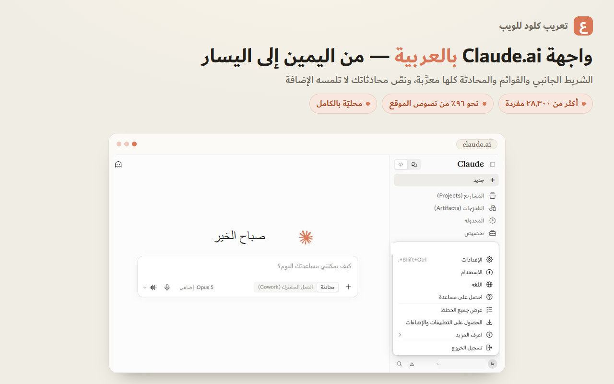
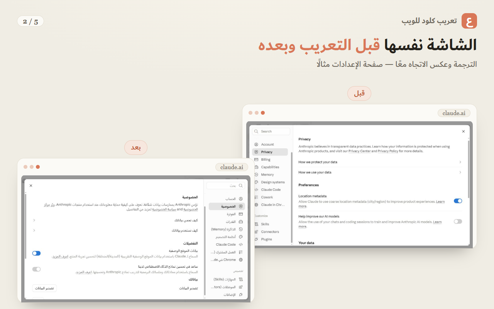

<div dir="rtl">

#  تعريب كلود للويب

**إضافة متصفح تعرض واجهة [claude.ai](https://claude.ai) بالعربية، بالاتجاه من اليمين إلى اليسار.**

مشروع مستقل غير رسمي · محليّ بالكامل · إذن واحد (`storage`) · مفتوح المصدر

<!-- الشارات: حالة CI والترخيص؛ وشارة متجر Chrome تُضاف بعد القبول:
     [](https://chromewebstore.google.com/detail/<ID>) -->
[](https://github.com/al-ashalash/claude-ai-arabic-chrome/actions/workflows/ci.yml)
[](LICENSE)





---

## لماذا؟

واجهة claude.ai تدعم إحدى عشرة لغة رسميًّا، وليست العربية منها. ودعمُ الاتجاه من اليمين
إلى اليسار ناقص، فالنصّ العربي يُحاذى يسارًا، ويختلّ ترتيبُه إذا خالطته إنجليزيةٌ أو أرقام أو
تعليمات برمجية. هذه الإضافة تسدّ الأمرين معًا: **تترجم الواجهة، وتعكس اتجاهها**.

## ما تفعله

| | |
|---|---|
| **ترجمة الواجهة** | قاموس فيه أكثر من **28,300** مفردة، يغطي نحو **96%** من نصوص الموقع (والباقي أسماءُ علاماتٍ ومعرِّفاتٌ تقنية لا تُترجَم) |
| **قواعد ذكية** | أكثر من **3,300** قاعدة للنصوص المتغيّرة (التواريخ، «قبل 3 أيام»، «الرسالة 1 من 2»…) |
| **صيغ الجمع العربية** | الفئات الست (`zero/one/two/few/many/other`) — لا «3 محادثة» ولا «11 محادثات» |
| **الاتجاه من اليمين إلى اليسار** | عكسُ التخطيط بورقةٍ تُبنى من ملفات تصميم الموقع نفسها وتُعاد كلما تغيّرت، واتجاهٌ مستقلٌّ لكل فقرة في المحادثة، والتعليمات البرمجية تبقى من اليسار |
| **تصحيح شخصي** | ابحث في القاموس كله وعدّل أي ترجمة لنفسك |
| **فحص الموقع وفحص الاتجاه** | بضغطة منك: يقرآن ملفات claude.ai العامة ليجدا ما استُجدّ ولم يُترجَم، وتنسيقاتٍ لم تُعكس بعد |

## الخصوصية — بدقّة

لتترجم الإضافةُ تسميةً فلا بدّ أن **تطابقها**، فهي إذن تقرأ نصوص الصفحة أثناء مرورها عليها
وتقارنها بقاموسٍ مضمَّن داخلها. **والفرق الذي يعنيك أن هذه القراءة عابرة للمطابقة وحدها:**

- **لا يُخزَّن شيء مما يُقرأ، ولا يُراكَم، ولا يُرسَل** — لا إلى تخزين، ولا إلى خادم، ولا إلى
  أي مكان. والكتابة الدائمة الوحيدة تفضيلاتُك وتصحيحاتُك التي تكتبها بنفسك.
- **نصّ المحادثات مستثنًى أصلًا** فلا تلمسه الترجمة — لا رسائلك ولا ردود Claude.
- **لا تجمع الإضافة بيانات عنك ولا عن استعمالك.** والطلبات الشبكية التي تفتحها
  الإضافة ثلاثة، كلها تقصد **ملفات الموقع العامة وحدها** (على claude.ai وanthropic.com
  حيث يقدّم الموقع ملفاته) ولا يُرسَل فيها شيءٌ من عندك: (١) **محرّك الاتجاه** يقرأ تلقائيًّا
  ملفات التنسيق (CSS) التي حمّلها متصفحك للصفحة نفسها — عند أول تشغيل وعند كل تغيّر في
  نسخة الموقع — ليبني منها ورقة العكس ويحفظها على جهازك (ويمكنك إيقاف ذلك باختيار المحرّك
  «المبسّط» في الإعدادات)؛ (٢) «فحص الموقع» (ليجد ما استُجدّ ولم يُترجَم) و(٣) «فحص
  الاتجاه» (ليُظهر ما لم يُعكس بعد) يجريان **بضغطةٍ منك وحدك**.
- **الاستثناء الوحيد لمغادرة بياناتك جهازك:** إن فعّلتَ المزامنة الاختيارية (وهي متوقّفة
  ما لم تُفعّلها) حمل **كرومُ نفسُه** تصحيحاتِك وقواعدَك — دون إعداداتك ودون شيءٍ من محتواك
  أو محادثاتك — إلى حسابك في جوجل بمزامنته المعتادة، لا باتصالٍ تفتحه الإضافة.
  **وجوجل قد تطّلع عليها ما لم تفعّل عبارة مرور المزامنة في كروم نفسه.** وتبقى لك
  أزرار إيقافها ومسح ما رُفع.
- **لا تطلب الوصول إلى أي موقع غير claude.ai.** وستعرض لك كروم عند التثبيت عبارتها
  المعيارية «قراءة بياناتك وتغييرها على claude.ai» — وهي الصيغة التي تصف بها كلَّ إضافة
  تعمل داخل صفحة، ومعناها هنا أن الإضافة تكتب الترجمة داخل الصفحة. والإذن الوحيد الذي
  تطلبه سوى ذلك `storage` لحفظ تفضيلاتك على جهازك.

نقولها بهذه الدقّة لأن الوعد المتجاوِز أضعفُ من الوعد الدقيق: المشروع مفتوح المصدر،
فكلُّ سطرٍ من هذا يمكنك التحقق منه بنفسك. التفصيل في [سياسة الخصوصية](PRIVACY.md).

## التثبيت

**من متجر Chrome:** *(قريبًا)* — وما الجديد والقيود المعروفة في [سجلّ الإصدارات](CHANGELOG.md).

**يدويًّا (نسخة التطوير):**

1. نزّل المستودع أو انسخه.
2. افتح `chrome://extensions` وفعّل **وضع المطوّر**.
3. اضغط **تحميل غير محزومة** واختر المجلد `extension`.
4. افتح [claude.ai](https://claude.ai) — تظهر الواجهة بالعربية.

> بعد أي تحديث للإضافة: اضغط **↻** على بطاقتها في `chrome://extensions`، ثم **Ctrl+Shift+R**
> على تبويب claude.ai. إعادة تحميل الإضافة لا تُحدِّث سكربتها في التبويبات المفتوحة من قبلُ.

### إيدج وسائر متصفحات Chromium

**إيدج وBrave وOpera** وكل ما بُني على Chromium: الإضافة نفسها تعمل عليها بلا تعديل — ثبّتها من
متجر Chrome مباشرة، أو يدويًّا بالخطوات أعلاه من `edge://extensions`.

**فايرفوكس:** غير مدعوم رسميًّا بعد. للمطوّرين نسخة تجريبية تُبنى محليًّا — انظر «للمساهمين».

---

## كيف أُنجزت الترجمة — إفصاح

بُني هذا القاموس **بمعونة [Claude Code](https://claude.com/claude-code)** (أداة Anthropic
للبرمجة بالذكاء الاصطناعي)، على قواعد مصطلحية ثابتة وضعها صاحب المشروع:

- ما يبقى إنجليزيًّا (العلامات التجارية والمصطلحات التقنية) وما يُترجَم.
- مصطلحاتُ الذكاء الاصطناعي مُسنَدةٌ إلى **معجم البيانات والذكاء الاصطناعي** (مجمع الملك سلمان العالمي للغة العربية وسدايا، الإصدار الثالث على منصة سوار) حيث وافق مقابلُ المعجم سياقَ الواجهة، وإلا فالمعروفُ في واجهات الأجهزة مع تسجيل مقابل المعجم بديلًا.
- نمط «الترجمة (English)» للعناوين المستقلة، والعربيةُ وحدها داخل الجُمل.
- توحيد المصطلح الواحد عبر ثمانيةٍ وعشرين ألف نصّ.

ومرّ كل نصّ بتدقيق آلي (تغطية، وسلامة المتغيّرات، واتساق المصطلح) ثم مراجعة.

**ونصرّح بهذا لأن من حقّك أن تعرف كيف صُنع ما تقرؤه.** ومع ذلك تبقى فيه أخطاء ولا بدّ —
ولهذا صُنعت «الكلمات المحفوظة»: صحّح ما استُشكل عليك لنفسك في أي وقت، أو
[افتح مسألة](https://github.com/al-ashalash/claude-ai-arabic-chrome/issues) لتصحيحه للجميع.

---

## للمساهمين

### تصحيح ترجمة

أسهل طريق: **افتح [مسألة](https://github.com/al-ashalash/claude-ai-arabic-chrome/issues)** واذكر النصّ
الإنجليزي كما هو، والترجمة الحالية، والترجمة التي تقترحها، وسببها.

أو عدّل `dictionaries/ar.json` مباشرة وأرسل طلب سحب. ثم:

```bash
node tools/build.mjs
```

### إضافة لغة

```bash
node tools/addlang.mjs <code> <endonym> <EnglishName>
```

ثم ترجم `dictionaries/<code>.json` وأعد البناء. الاتجاه يُكتشف تلقائيًّا.

### نسخة فايرفوكس التجريبية (للمطوّرين)

فايرفوكس MV3 يريد مانيفستًا مختلفًا قليلًا، فتُبنى نسخته على حدة:

```bash
node tools/build-firefox.mjs
```

ثم تُحمَّل **مؤقتةً** من `about:debugging#/runtime/this-firefox` (اختر `manifest.json` من المجلد
المولَّد `extension-firefox`؛ تزول بإغلاق المتصفح). ومنذ فايرفوكس 127 لا يُمنح إذن claude.ai عند
التثبيت: افتح صفحة إعدادات الإضافة واضغط «منح الإذن لموقع claude.ai» ثم حدّث تبويبات claude.ai.

### الاختبارات

شغّل خادم الاختبارات ثم افتح الصفحات منه، واقرأ النتيجة من **عنوان التبويب** (`اسم N/N` = كله ناجح):

```bash
node tools/serve-tests.mjs
```

ثم افتح `http://localhost:8794/test/<الصفحة>`. فتحُ الصفحات بالنقر المزدوج (`file://`)
لا يصلح للفحص الكامل: المتصفح يمنع `fetch` هناك، فالصفحات التي تحتاجها تتخطى ذلك الجزء
بصفّ إرشادٍ ظاهر بدل إخفاقات كاذبة.

| الملف | ما يختبره |
|---|---|
| `_selftest.html` | المحرّك: الترجمة، والأنماط، والجموع، والتطبيق الحيّ |
| `_ruletest.html` | توليد القواعد الذكية وحرّاسُ الأمان |
| `_scantest.html` | الزحف التعاودي على ملفات الموقع |
| `_dirtest.html` | اتجاه نصّ المحادثة |
| `_scanlocktest.html` | حجز الفحص ونبضه (طبقة السقوط) |
| `_swtest.html` | تحكيم عامل الخدمة — سيناريوهات التبويبات المتعددة |
| `_rtltest.html` | محرّك الاتجاه: العكس المنطقي وجزر LTR والناتج المولَّد |
| `_termstest.html` | البحث في القاموس والتصحيح الشخصي |
| `_synctest.html` | المزامنة الاختيارية: التعقيم والدمج والتمزّق والإصلاح |
| `_thumbtest.html` | المؤشر المنزلق والأسطح التي يحسبها الموقع بنفسه |

### بنية المشروع

```
extension/      الإضافة الجاهزة (حمّلها غير محزومة)
dictionaries/   ★ القاموس المصدر — المصدر الوحيد للحقيقة
tools/          أدوات البناء (Node خالص، بلا npm)
test/           الاختبارات
```

`dictionary.js` **مُولّد** — لا تعدّله يدويًّا؛ عدّل `ar.json` ثم أعد البناء.

---

## الترخيص

[MIT](LICENSE) — الترجمة العربية عملُ هذا المشروع.

النصوص الإنجليزية مفاتيحُ القاموس، وهي مملوكة لـ Anthropic PBC، ولا تُدرَج إلا بالقدر
اللازم لمطابقة الواجهة وتعريبها.

«Claude» و«Claude.ai» و«Anthropic» علامات تجارية لمالكها. هذا المشروع مستقل غير رسمي،
ليس من إنتاج Anthropic ولا تابعًا لها.

</div>

---

<div dir="ltr">

#  Claude Web — Arabic Localization

A browser extension that renders the [claude.ai](https://claude.ai) interface in Arabic, with
proper right-to-left layout.

Independent and unofficial · fully local · one permission (`storage`) · open source

## Why

claude.ai's interface officially supports eleven languages; Arabic is not among them. RTL support
is also incomplete — Arabic text is left-aligned, and its order breaks when mixed with English,
numbers, or code. This extension addresses both: **it translates the interface and mirrors its
direction.**

## What it does

| | |
|---|---|
| **Interface translation** | A dictionary of **28,300+** entries covering about **96%** of the site's strings (the rest are brand names and technical identifiers that stay as they are) |
| **Smart rules** | **3,300+** rules for variable text (dates, "3 days ago", "message 1 of 2"…) |
| **Arabic plurals** | All six categories (`zero/one/two/few/many/other`) — never "3 محادثة" or "11 محادثات" |
| **Right-to-left layout** | The layout is mirrored by a stylesheet built from the site's own CSS and rebuilt whenever the site changes; each paragraph in a conversation gets its own direction; code stays left-to-right |
| **Personal corrections** | Search the whole dictionary and change any translation for yourself |
| **Site scan and direction check** | On your click: read claude.ai's public files to find newly added strings not yet translated, and styles not yet mirrored |

## Privacy, stated precisely

To translate a label the extension must first **match** it, so it does read page text as it walks
the DOM, comparing it against a dictionary bundled inside the extension. **What matters to you is
that those reads are transient and match-only:**

- **Nothing read is stored, accumulated, or transmitted** — not to storage, not to a server, not
  anywhere. The only persistent writes are your own settings and the corrections you type.
- **Conversation text is excluded outright** — translation never touches your messages or
  Claude's replies.
- **The extension collects no data about you or your usage.** It makes three kinds of network
  request, all for **the site's own public asset files only** (served from claude.ai and
  anthropic.com), and nothing of yours is sent in any of them: (1) the **RTL engine** automatically
  reads the stylesheets your browser already loaded for the page — on first run and whenever the
  site ships a new version — to build its mirroring sheet, cached on your device (choose the
  "simplified" engine in the options to turn this off); (2) the **site scan** (newly added
  untranslated strings) and (3) the **direction check** (styles not yet mirrored) run **only when
  you press a button**.
- **The one exception to data leaving your device:** if you enable the optional cross-device sync
  (off unless you turn it on), the corrections and smart rules you wrote yourself — never your
  settings, and never any of your content or conversations — are carried by **Chrome's own sync**
  to your Google account, not by a connection the extension opens. **Google may be able to read
  them unless you set a sync passphrase in Chrome itself.** Buttons to stop it and to wipe what was
  uploaded remain yours.
- **It asks for no site other than claude.ai.** Chrome's install screen shows its standard "read
  and change your data on claude.ai" line because the extension writes translations into that one
  site's pages; the only other permission is `storage`, for your preferences.

We say it this precisely because an overreaching claim is weaker than an exact one, and this is
open source: verify it yourself. Details in the [privacy policy](PRIVACY.md).

## Install

**From the Chrome Web Store:** *(coming soon)* — what's new and known limitations are in the
[changelog](CHANGELOG.md).

**Manually (development build):**

1. Download or clone the repository.
2. Open `chrome://extensions` and turn on **Developer mode**.
3. Click **Load unpacked** and choose the `extension` folder.
4. Open [claude.ai](https://claude.ai) — the interface appears in Arabic.

> After updating the extension: press **↻** on its card in `chrome://extensions`, then
> **Ctrl+Shift+R** on the claude.ai tab. Reloading the extension does not refresh its script in
> tabs that were already open.

### Edge and other Chromium browsers

**Edge, Brave, Opera** and anything built on Chromium: the same extension works unchanged — install
it from the Chrome Web Store, or manually with the steps above from `edge://extensions`.

**Firefox:** not officially supported yet. A developer-only build is described under
*Contributing*.

---

## How the translation was made — disclosure

The dictionary was built **with the help of [Claude Code](https://claude.com/claude-code)**
(Anthropic's AI coding tool), following a fixed terminology rulebook set by the project's author:

- What stays in English (brand names and technical terms) and what is translated.
- AI terminology is anchored to the **Data and AI Glossary** (King Salman Global Academy for Arabic
  Language and SDAIA, 3rd edition on the Siwar platform) wherever the glossary's equivalent fits
  the interface context; otherwise the term users already know from their devices is used, and the
  glossary's equivalent is recorded as an alternative.
- The "Translation (English)" pattern for standalone headings, Arabic only inside sentences.
- One consistent term across twenty-eight thousand strings.

Every string passed automated checks (coverage, placeholder integrity, term consistency) and then
review.

**We state this plainly because you deserve to know how what you read was made.** Errors
nonetheless remain — which is why personal corrections exist: fix anything for yourself at any
time, or [open an issue](https://github.com/al-ashalash/claude-ai-arabic-chrome/issues) to fix it
for everyone.

---

## Contributing

### Fix a translation

Easiest path: **[open an issue](https://github.com/al-ashalash/claude-ai-arabic-chrome/issues)**
with the English text exactly as shown, the current translation, the one you propose, and why.

Or edit `dictionaries/ar.json` directly and send a pull request. Then:

```bash
node tools/build.mjs
```

### Add a language

```bash
node tools/addlang.mjs <code> <endonym> <EnglishName>
```

Then translate `dictionaries/<code>.json` and rebuild. Direction is detected
automatically.

### Firefox developer build

Firefox MV3 wants a slightly different manifest, so its build is produced separately:

```bash
node tools/build-firefox.mjs
```

Then load it **temporarily** from `about:debugging#/runtime/this-firefox` (pick `manifest.json`
from the generated `extension-firefox` folder; it goes away when the browser closes). Since
Firefox 127 the claude.ai permission is not granted on install: open the extension's options page
and press "Grant permission for claude.ai", then reload your claude.ai tabs.

### Tests

Start the test server, open the pages from it, and read the result from the **tab title**
(`name N/N` = all passing):

```bash
node tools/serve-tests.mjs
```

Then open `http://localhost:8794/test/<page>`. Opening the pages by double-click (`file://`)
does not give a full check: the browser blocks `fetch` there, so the pages that need it skip that
part with a visible notice instead of false failures.

| File | What it tests |
|---|---|
| `_selftest.html` | The engine: translation, patterns, plurals, live application |
| `_ruletest.html` | Smart-rule generation and its safety guards |
| `_scantest.html` | Recursive crawl of the site's bundles |
| `_dirtest.html` | Chat text direction |
| `_scanlocktest.html` | Scan claim and heartbeat (fallback layer) |
| `_swtest.html` | Service-worker arbitration — multi-tab scenarios |
| `_rtltest.html` | RTL engine: logical mirroring, LTR islands, generated output |
| `_termstest.html` | Dictionary search and personal corrections |
| `_synctest.html` | Optional sync: sanitizing, merging, torn writes, repair |
| `_thumbtest.html` | Slider thumb and surfaces the site positions itself |

### Project layout

```
extension/      the ready extension (load it unpacked)
dictionaries/   ★ the source dictionary — the single source of truth
tools/          build tools (plain Node, no npm)
test/           tests
```

`dictionary.js` is **generated** — never edit it by hand; edit `ar.json` and rebuild.

---

## License

[MIT](LICENSE) for the Arabic translation and code. The English source strings are dictionary keys
owned by Anthropic PBC, included only as far as necessary for interoperability. "Claude",
"Claude.ai", and "Anthropic" are trademarks of their owner; this project is independent and
unofficial.

</div>
